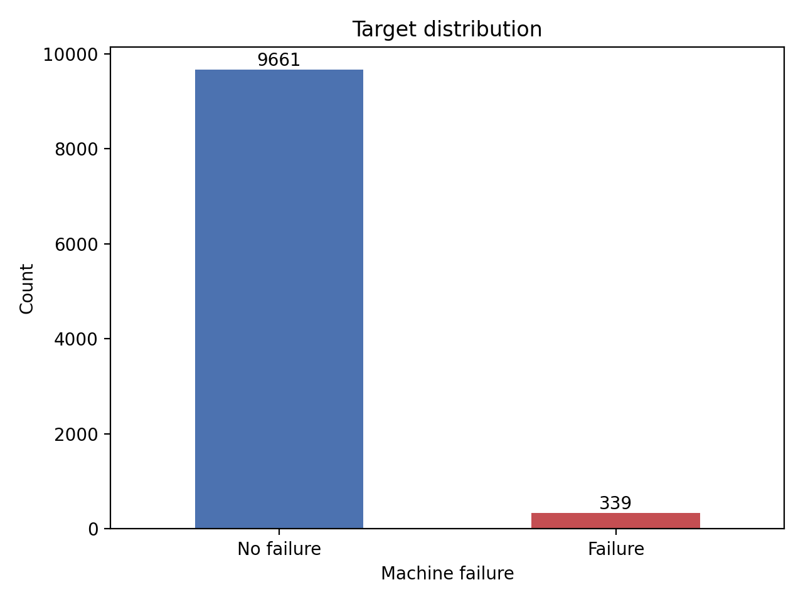
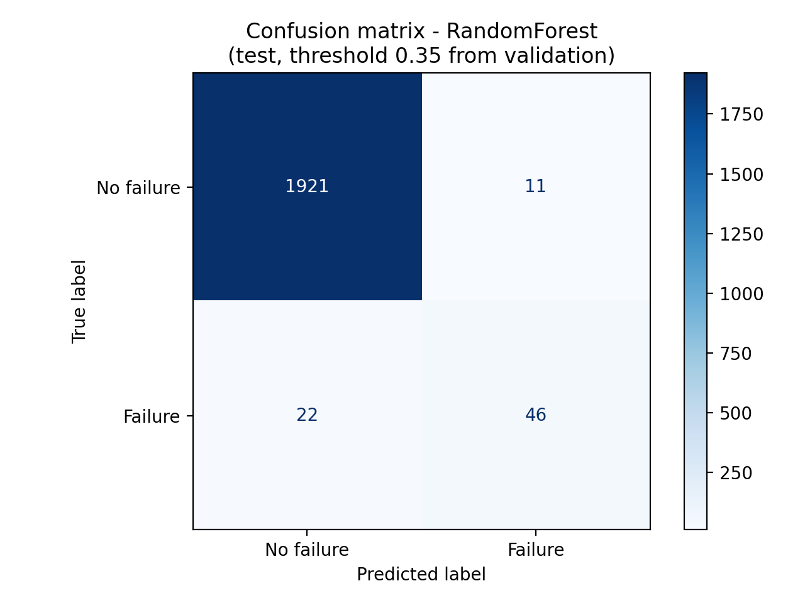
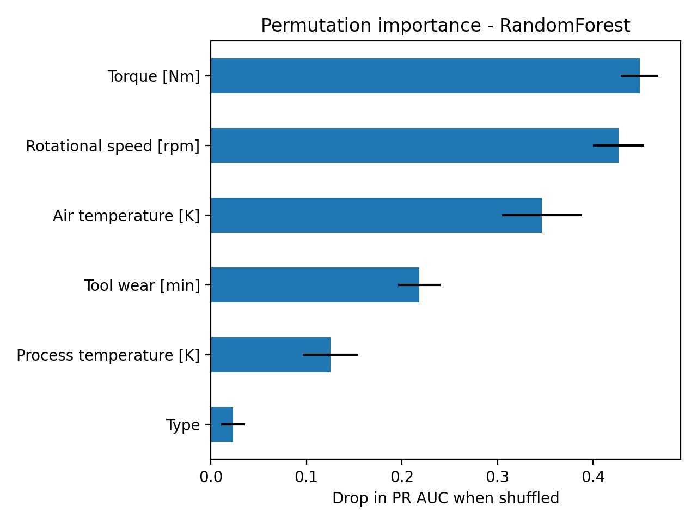
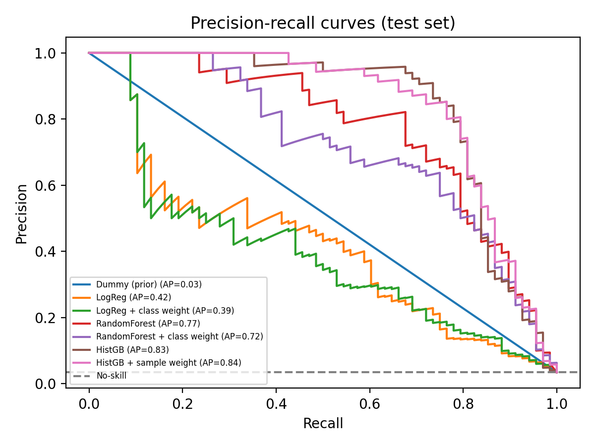

# Predictive-Maintenance-with-Imbalanced-Data
Retake project for Machine Learning and Smart Systems 2026

Author: Khumoyun Djuraev
Individual project - Summer 2026 retake.

**The data are SYNTHETIC.** Results describe this generated dataset, not real machines.

## Data
Matzka, S. (2020). *AI4I 2020 Predictive Maintenance Dataset*. UCI Machine Learning Repository. https://doi.org/10.24432/C5HS5C (CC BY 4.0)

Download `ai4i2020.csv` from the UCI page and put it at `data/ai4i2020.csv`. (The CSV is not committed.)

## Setup and run
```
pip install -r requirements.txt
python run_experiments.py --data data/ai4i2020.csv --out results
```
Runs in about a minute on a laptop CPU, seed fixed to 42.

## Method summary
- Target: `Machine failure`. Dropped `UDI`, `Product ID`, and TWF/HDF/PWF/OSF/RNF (failure-mode columns define the target, so keeping them is leakage).
- Stratified 60/20/20 train/validation/test split.
- Models: dummy, logistic regression, random forest, histogram gradient boosting, each with and without imbalance handling.
- Decision threshold chosen on validation only; test set used once for final numbers.
- Metrics: PR AUC, failure recall, precision, F1, confusion matrix.

## Results




See `results/` (`model_comparison.csv`, figures, `false_negatives.csv`). Paste the final table here after running.

## AI assistance
Claude version Sonnet 5 was used to generate the code files.
